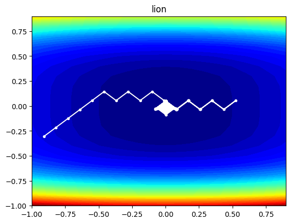
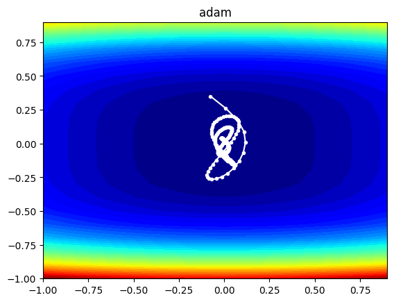
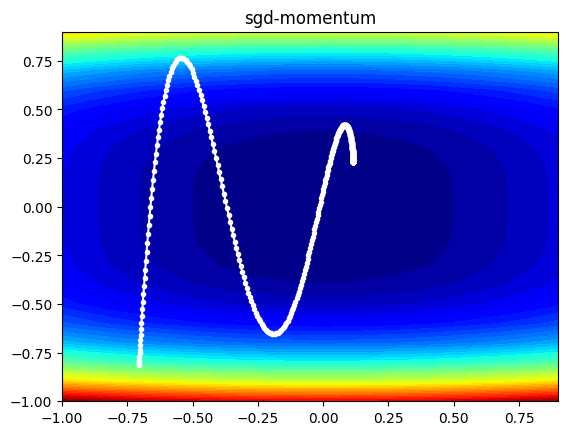
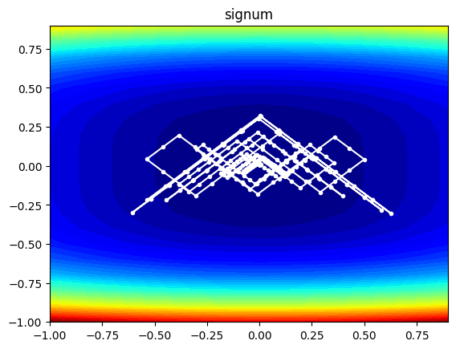

# Lion-vs-Adam
Lion 与 Adam 优化器对比

Lion优化器趋向于在大范围进行搜索解空间以后再进行小范围搜索，与adam不同，adam趋向于直接使用小范围局部的梯度直接走向局部最小值，此外SGD也有类似的表现，而SIGNUM则与Lion相近，但是由于其没有衰减系数，无法快速的锁定大致范围。此外Lion优化器必须搭配学习率衰减。

---
## Lion

## Adam

## SGD

## SIGNUM
