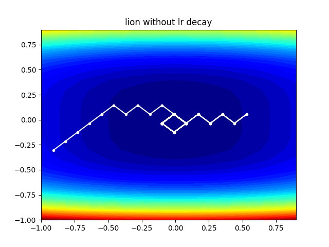
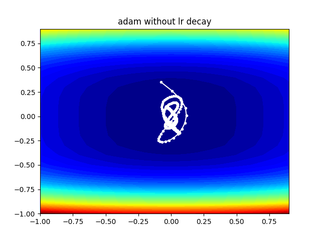
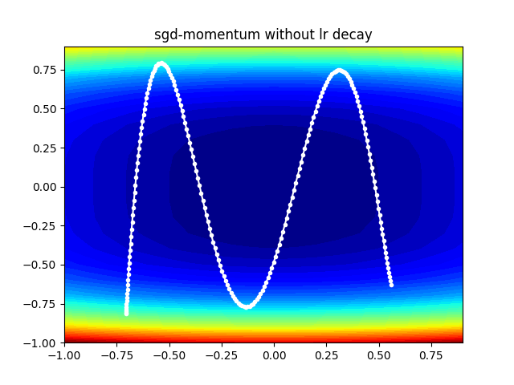
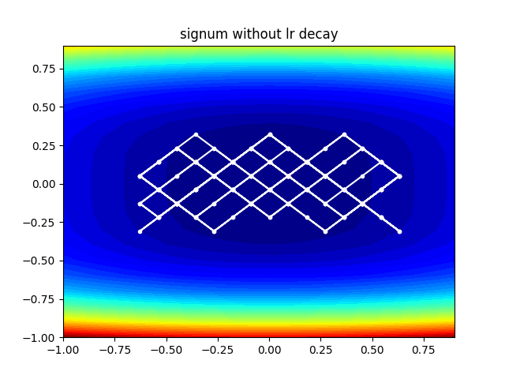

# Lion-vs-Adam

## 🦁 Lion (EvoLved Sign Momentum)
 [Lion](https://arxiv.org/abs/2302.06675 "Lion") , EvoLved Sign Momentum, Google Brain发现的新优化器，据称比Adam(W)更好。 

对Lion与Adam及其他接近的优化器进行了二维优化的可视化对比，发现：

- Lion优化器趋向于在大范围进行搜索解空间以后再进行小范围搜索
- Adam(W) 优化器趋向于直接使用小范围局部的梯度直接走向局部最小值，此外SGD也有类似的表现
- SIGNUM则与Lion相近，但是由于其没有衰减系数，无法快速的锁定大致范围，而在大范围内跳跃。
- Lion优化器必须搭配学习率衰减,适配的学习率衰减策略应该在大学习率时有效的跳过局部最小值，并快速锁定全局最小值所在范围，然后使用小学习率收敛至全局最小值。


---

## With lr decay

### Lion

 


### Adam
 


### SGD


### SIGNUM
 

## Without lr decay

### Lion


### Adam
 


### SGD



### SIGNUM
 


## Citations
```
@misc{https://doi.org/10.48550/arxiv.2302.06675,
    url     = {https://arxiv.org/abs/2302.06675},
    author  = {Chen, Xiangning and Liang, Chen and Huang, Da and Real, Esteban and Wang, Kaiyuan and Liu, Yao and Pham, Hieu and Dong, Xuanyi and Luong, Thang and Hsieh, Cho-Jui and Lu, Yifeng and Le, Quoc V.},
    title   = {Symbolic Discovery of Optimization Algorithms},
    publisher = {arXiv},
    year = {2023}
}
```